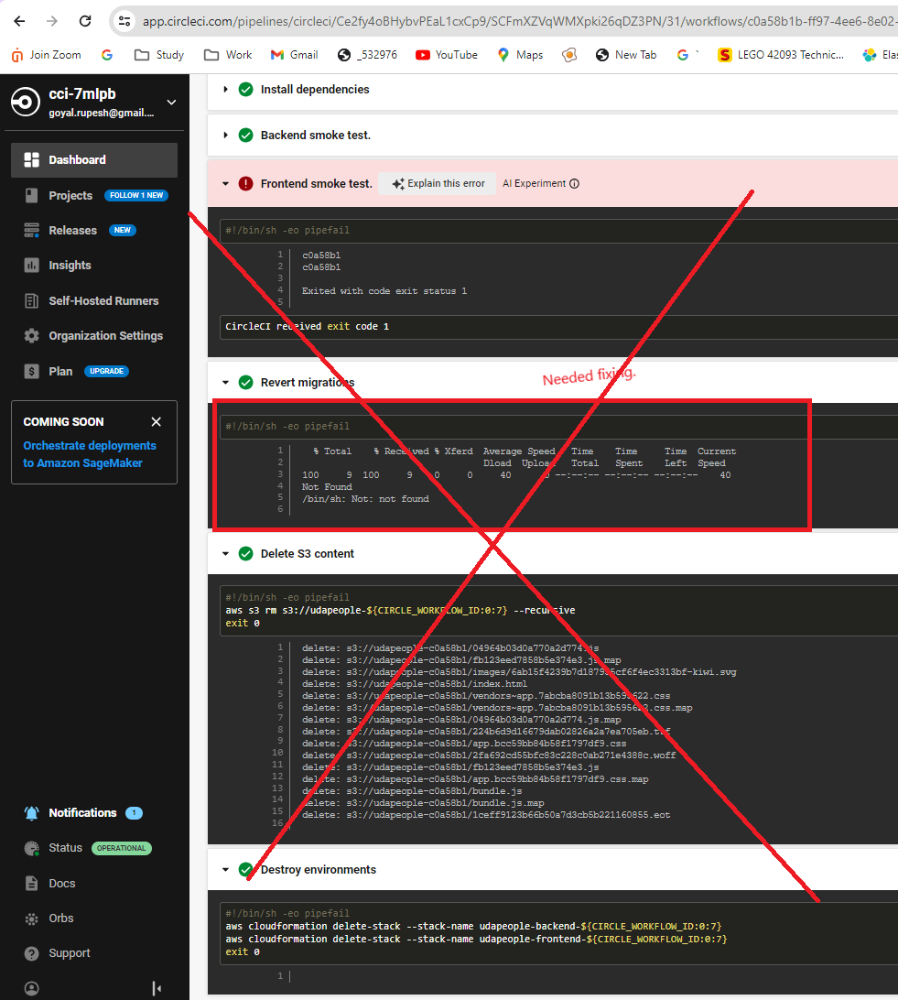
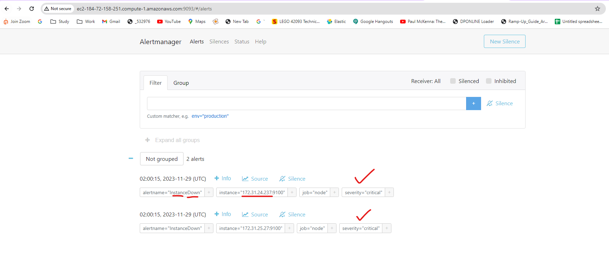

## Give your Application Auto-Deploy Superpowers

### Section 1: Selling CI/CD to your Team/Organization

Benefits of CI/CD to achieve, build, and deploy automation

### Speedy Golive from Development to Producton: 
CI/CD enables developers to release new features and updates more frequently. By automating the build and deployment processes, developers can quickly deliver changes to production, reducing the time it takes to bring new features to end-users.

### Early Bug Detection by automated testing: 
With CI/CD, code changes are continuously integrated and tested.
By catching and addressing issues early on, developers can prevent them from becoming larger and more difficult to fix later.

### Production Level Quality from the begening : 
CI/CD encourages developers to write clean, modular, and testable code.  
This leads to improved code quality and reduces the golive time in Production.

### Scale-Up and Scale-down
In case increase or decressed usage, CI/CD automated enable us to Scale-up and down quickly with no downtime.

### Disaster Recovery and Rollback
In case of any issues or failures during deployment, CI/CD automated recovery, minimizing downtime and reducing the impact on end-users.

Overall, CI/CD helps developers to focus more on writing code and delivering value to end-users fast with quality and scalabilty.

### Section 2: Deploying Working, Trustworthy Software
<h3 href="#Screenshots">Screenshots</h3>
<h4>Diagram of CI/CD Pipeline I have build. </h4>

### Project URLs :
- [Public Url to GitHub repository (not private)](https://github.com/rupesh291/udacity-cicd-project/) - Public Url to GitHub repository (not private)
- [ Public URL for your S3 Bucket (aka, your green candidate](http://udapeople-7bbfc43.s3-website.us-east-1.amazonaws.com/#/employees) - Public URL for your S3 Bucket (aka, your green candidate front-end) 
- [Public URL for your CloudFront distribution (aka, your blue production front-end)](https://d2gaubmerxan3c.cloudfront.net/#/employees) - Public URL for your CloudFront distribution (aka, your blue production front-end)
- [backend ec2 update with every deployment, I am going to run the git commit](http://52.91.129.133:3030/api/status) - backend ec2 update with every deployment, I am going to run the git commit 
- [Prometheus MemFree Stats](http://ec2-184-72-158-251.compute-1.amazonaws.com:9090/targets) - Prometheus MemFree Stats
- [Prometheus Alert Manager](http://ec2-184-72-158-251.compute-1.amazonaws.com:9093/#/alerts) - Prometheus Alert Manager
  
<h3 href="#Screenshots">Project Screenshots</h3>
<ol>
<li>
  <h4>Backend build failed. SCREENSHOT01 </h4>
  
</li>
 <li>
  <h4>Backend build failure. SCREENSHOT02 </h4>
  
</li>
 <li>
  <h4>Job that failed because of vulnerable packages. SCREENSHOT03 </h4>
  
</li>
 <li>
  <h4>An alert from one of your failed builds. SCREENSHOT04 </h4>
  
</li>
 <li>
  <h4>Appropriate job failure for infrastructure creation. [SCREENSHOT05] </h4>
  
</li>
 <li>
  <h4>Appropriate job failure for the smoke test job. [SCREENSHOT06] </h4>
  
  
</li>
 <li>
  <h4>Successful rollback after a failed smoke test. [SCREENSHOT07] </h4>
  
</li>
 <li>
  <h4>Successful Cloudfront promotion job. [SCREENSHOT08] </h4>
  
</li>
 <li>
  <h4>Successful cleanup job. [SCREENSHOT09] </h4>
  
</li>
 <li>
  <h4>Only deploy on pushed to `master` branch. [SCREENSHOT10] </h4>
  
</li>
</ol> 

### Section 3: Turn Errors into Sirens
 <ol> 
 <li>
  <h4>Provide a screenshot of a graph of your EC2 instance including available memory, available disk space, and CPU usage. [SCREENSHOT11] </h4>
  
  <h4>Update Screen Shot Provide a screenshot of a graph of your EC2 instance including available memory, available disk space, and CPU usage. [SCREENSHOT11] </h4>
   
</li>
 <li>
  <h4>Provide a screenshot of an alert that was sent by Prometheus. [SCREENSHOT12] </h4>
  
    <h4>Provide a screenshot of monitored EC2 instances.  [URL05_SCREENSHOT] </h4>
  
</li>
</ol>  

- Your presentation should be in PDF format named "presentation.pdf" and should be included in your code repository root folder. 

Before you submit your project, please check your work against the project rubric. If you haven’t satisfied each criterion in the rubric, then revise your work so that you have met all the requirements. 

### Tooling
- [Circle CI](www.circleci.com) - Cloud-based CI/CD service
- [Amazon AWS](https://aws.amazon.com/) - Cloud services
- [AWS CLI](https://aws.amazon.com/cli/) - Command-line tool for AWS
- [CloudFormation](https://aws.amazon.com/cloudformation/) - Infrastrcuture as code
- [Ansible](https://www.ansible.com/) - Configuration management tool
- [Prometheus](https://prometheus.io/) - Monitoring tool

### License

[License](LICENSE.md)
