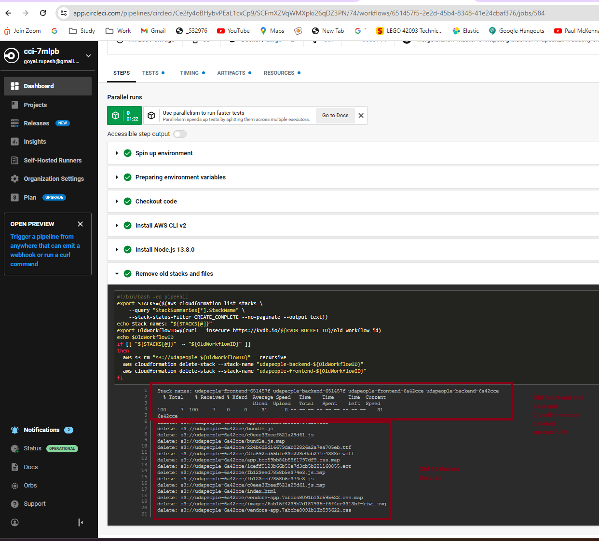

## Give your Application Auto-Deploy Superpowers
(udapeople.png)

### Section 1: Selling CI/CD to your Team/Organization

- [UdaPeople CICD Proposal for business](https://github.com/rupesh291/udacity-cicd-project/blob/master/ScreenShots/UdacityCICDproposal.pdf) - URL to UdaPeople CICD Proposal for business.
(https://github.com/rupesh291/udacity-cicd-project/blob/master/ScreenShots/UdacityCICDproposal.pdf)

<h3>Diagram of Proposed CI/CD Pipeline </h3>

### Section 2: Deploying Working, Trustworthy Software
<h3 href="#Screenshots">Screenshots</h3>

### Project URLs :
- [Public Url to GitHub repository (not private)](https://github.com/rupesh291/udacity-cicd-project/) - Public Url to GitHub repository (not private)
- [ Public URL for your S3 Bucket (aka, your green candidate](http://udapeople-6a42cce.s3-website.us-east-1.amazonaws.com/#/employees) - Public URL for your S3 Bucket (aka, your green candidate front-end) 
- [Public URL for your CloudFront distribution (aka, your blue production front-end)](http://d2gaubmerxan3c.cloudfront.net/#/employees) - Public URL for your CloudFront distribution (aka, your blue production front-end)
- [backend ec2 update with every deployment, I am going to run the git commit](http://54.175.47.107:3030/api/status) 
- [Prometheus EC2 status](http://ec2-54-167-29-21.compute-1.amazonaws.com:9090/targets) - Prometheus EC2 status
- [Prometheus Alert Manager](http://ec2-54-167-29-21.compute-1.amazonaws.com:9093/#/alerts) - Prometheus Alert Manager
  
<h3 href="#Screenshots">Project Screenshots</h3>
<ol>
<li>
  <h4>Backend build failed. SCREENSHOT01 </h4>
  
</li>
 <li>
  <h4>Backend build failure. SCREENSHOT02 </h4>
  
</li>
 <li>
  <h4>Job that failed because of vulnerable packages. SCREENSHOT03 </h4>
  
</li>
 <li>
  <h4>An alert from one of your failed builds. SCREENSHOT04 </h4>
  
</li>
 <li>
  <h4>Appropriate job failure for infrastructure creation. [SCREENSHOT05] </h4>
  
</li>
 <li>
  <h4>Appropriate job failure for the smoke test job. [SCREENSHOT06] </h4>
  
  
</li>
 <li>
  <h4>Successful rollback after a failed smoke test. [SCREENSHOT07] </h4>
  
  <h4>Updated after review, Successful rollback after a failed smoke test. [SCREENSHOT07] </h4>
  
  database details added.
</li>
 <li>
  <h4>Successful Cloudfront promotion job. [SCREENSHOT08] </h4>
  
</li>
 <li>
  <h4>Successful cleanup job. [SCREENSHOT09] </h4>
  
</li>
 <li>
  <h4>Only deploy on pushed to `master` branch. [SCREENSHOT10] </h4>
  
  <h4>Updated after review, Only deploy on pushed to `master` branch. [SCREENSHOT10] </h4>
  
  <h3>Note: after taking the screen shot I am using DEV branch to activate the CICD pipe line, so that I can update readme in master branch without triggering the CICD pipeline </h3>
</li>
</ol> 

### Section 3: Turn Errors into Sirens
 <ol> 
 <li>
  <h4>Provide a screenshot of a graph of your EC2 instance including available memory, available disk space, and CPU usage. [SCREENSHOT11] </h4>
  
  <h4>Update Screen Shot Provide a screenshot of a graph of your EC2 instance including available memory, available disk space, and CPU usage. [SCREENSHOT11] </h4>
   
</li>
 <li>
  <h4>Provide a screenshot of monitored EC2 instances.  [URL05_SCREENSHOT] </h4>
  

  <h4>Provide a screenshot of Backend EC2 Server  [URL05_SCREENSHOT] </h4>
  
   <h4>Current backend EC2 instance is different compate to provided screen shot due to multiple releases </h4>
    <h4>Provide a screenshot of monitored FreeMemory.  [URL05_SCREENSHOT] </h4>
  
    <h4>Provide a screenshot of monitored CPU Usage.  [URL05_SCREENSHOT] </h4>
  
    <h4>Provide a screenshot of monitored Disk Usage.  [URL05_SCREENSHOT] </h4>
  

  <h4>Provide a screenshot of an alert that was sent by Prometheus. [SCREENSHOT12] </h4>
  
  <h4>Provide a screenshot of an alert that was sent by Prometheus on Slack. [SCREENSHOT12] </h4>
  
</li>
</ol>  

- Your presentation should be in PDF format named "presentation.pdf" and should be included in your code repository root folder. 

Before you submit your project, please check your work against the project rubric. If you haven’t satisfied each criterion in the rubric, then revise your work so that you have met all the requirements. 

### Tooling
- [Circle CI](www.circleci.com) - Cloud-based CI/CD service
- [Amazon AWS](https://aws.amazon.com/) - Cloud services
- [AWS CLI](https://aws.amazon.com/cli/) - Command-line tool for AWS
- [CloudFormation](https://aws.amazon.com/cloudformation/) - Infrastrcuture as code
- [Ansible](https://www.ansible.com/) - Configuration management tool
- [Prometheus](https://prometheus.io/) - Monitoring tool

### License

[License](LICENSE.md)
